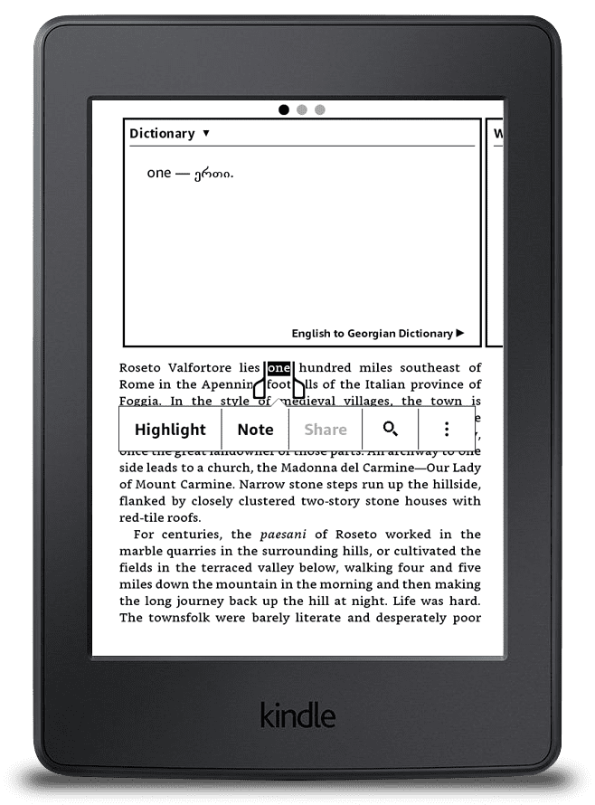

გადავწვყიტე გამეკეთებინა Open Source ინგლისურ-ქართული ლექსიკონი ქინდლის ყველა ვერსიითვის. ლექსიკონი დახვეწის პროცესშია თუმცა საკმაო სიტყვების რაოდენობა უკვე დაგროვდა. ლექსიკონის გამოყენება მარტივია: ქინდლში კითხვის დროს მონიშნავთ სიტყვას და გამოვა ფანჯარა სადაც იქნება მნიშნვნელობა ქართულად (ისე როგორც სურათზეა მოცემული)

ნათარგმნი სიტყვების რაოდენობა — **40533**

პროექტის source code და ასევე უკვე დაგენერირებული ლექსიკონი დევს Gihub-ზე ( Release-ებში). ამ მეთოდით შეიძლება შეიქმნას ნებისმიერი ლექსიკონი ნებისმიერ ენებს შორის.

სიტყვების სათარგმნად გამოყენებულია Google Translate Api რადგან უფასოა, თუმცა შესაძლებელია თქვენთვის სასურველი ნებისმიერი api-ს გამოყენება.

პროექტის გითჰაბის მისამართი:
[English to Georgian Dictionary for Kindle e-Readers](https://github.com/shakogegia/english_georgian_dictionary_kindle)

ლექსიკონის მისამართი: [Dictionary](https://github.com/shakogegia/english_georgian_dictionary_kindle/releases/download/0.1/dict.mobi)

ლექსიკონის ქინდლში ჩაწერა/დაყენების ინსტრუქცია წერია პროექტის README.md-ში
